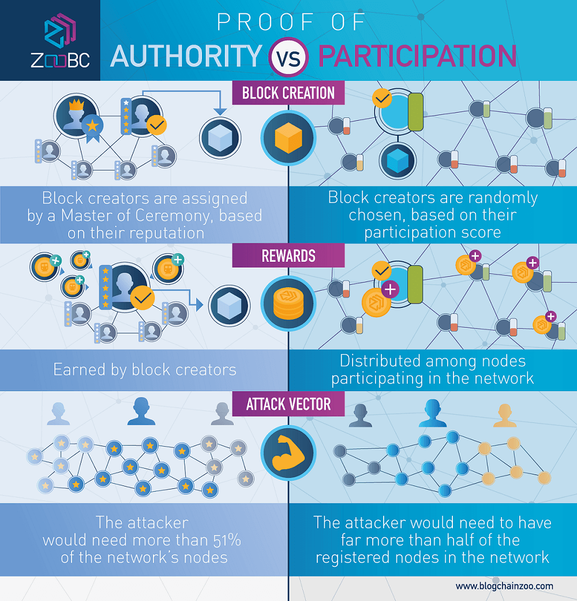

##  Blockchain technology is changing the global economy, our ecosystem, and day to day life. Why not Voting?!

#### EZVote is a decdecentralized voting application build on top of Ethereum  in the form of a smart contract. The election authority issues public keys for eligible voters that they can then use to vote for their favorable candidate from the comforat of their home.

### Countries that conducted Elections on the blockchain
**Sierra Leone** is a country on the southwest coast of West Africa. it  conducted a Blockchain-based voting system on March 7 and became the first country to become so. Leonardo Gammar of Agora, stored votes in an immutable distributed ledger, thereby offering instant access to the election results.

**Russia**  launched a blockchain-based electronic voting system pilot project in June 2019. 

## Tools Used to build this project:

**1- Blockchain Testnet build on Ethereum using proof-of-authority(POA) consensus algorithm.**

for more detailed instructions on how to build PoA blockchain testnet, [you can refer to this repo.](https://github.com/SashaFlores/Blockchain_Developement)

**2- Solidity Smart Contract on Remix**

is trackable and irreversible, Once the smart contract has been deployed nobody can edit the code or change its execution behavior.

Remix IDE is an open source web and desktop application that's used to write, compile and debug Solidity code, [you can use Remix from this link](https://remix.ethereum.org/)

**3- Ganache**

is our local blockchain that established in the first step, you can download from this link:

[Ganache site](https://www.trufflesuite.com/ganache)

and create a workspace in localhost(127.0.0.1) with port 8545

**4-MetaMask**

It allows you to run Ethereum dApps right in your browser without running a full Ethereum node

you can download from this link:
[MetaMask site](https://metamask.io/)

**5-FrontEnd**

Using The InterPlanetary File System [IPFS](https://ipfs.io/), javacript, & local host 8000 to run the User Interface dapp.

# Resources

- [View & Pure functions in solidity](https://docs.soliditylang.org/en/v0.4.25/contracts.html?highlight=view%20pure#view-functions)
- [State, Local, & Global Variables in Solidity](https://www.tutorialspoint.com/solidity/solidity_quick_guide.htm)
- [Sierra Leone](https://en.wikipedia.org/wiki/Sierra_Leone)
- [Top countries conducted blockchainvoting ](https://www.blockchain-council.org/blockchain/top-countries-that-conducted-elections-on-the-blockchain/)
