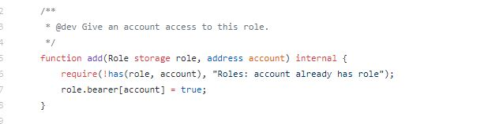
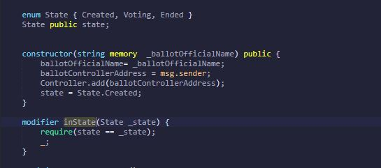

#  Roles-Based Access Contract

In the third development of EZVote project, I used 2 libraries to dynamically iterate ID given to candidates and to apply restrictions on each roles managing contract functions.

#### In versions 2.0.0, [`Roles.sol`](https://github.com/OpenZeppelin/openzeppelin-contracts/blob/release-v2.5.0/contracts/access/Roles.sol) is an Embedded Library; which has to be deployed as part of the code in any smart contract. Starting from versions 3.0.0, you can import [`AccessControl.sol`](https://github.com/OpenZeppelin/openzeppelin-contracts/blob/release-v3.0.0/contracts/access/AccessControl.sol) as an Abstract Contract.

* calling Embedded Liab. by `using Roles for Roles.Role;` for `Roles.sol` and `using Counters for Counters.Counter;` to track the number of elements in mapping by giving it an ID and incrementing IDs per each element added.

- Controller Role: which will have the right to add Candidates, authorized Admins Roles and Open Ballots.
- Admins Role: which will the have the right to add voters and End voting process.

To add a role, we have to use `has(role, account)` as per `Roles.sol` as follows:

### Modifiers

Implementing `has(role, account)` in modifier to restrict function access as follows:

1- `onlyController` modifier
`require` that `msg.sender` has the `Controller` role

2- `onlyAdmins` modifier
`require` that `msg.sender` has the `Admins` role

After creating roles and modifiers, we have to specify who is going to be the Controller and who are the Admins ... to set Controller I choose to add it in constructor instead of a function because I will have only One Controller in this voting process, which will be the contract deployer. While having multiple Admins; at least one for each State, so creating a function to allow `onlyController` to add `Admins` by address

### Constructor

* By passing State Variables `ballotOfficialName` to be manually entered before contract is deployed makes the contract reusable.
* `ballotControllerAddress` will be the global variable `msg.sender`
* adding `ballotControllerAddress` as the `Controller` of this contract.

### Enum
Enum types allow you to easily control when a function in your smart contract can and cannot be called.  We will create 3 `States` for our contract `Created` is when we are creating the functions to build our contract before voting take place, `Voting`is when the actual voting starts, and `Ended` is when voting is ended. 

And we will store our`State` in public state variable callled `state`

instead of adding `require` statement in each function, for eaxmple:

    function vote() public{require(status ==Status.Voting)}

we will create a modifier to enforce State and update it when State is achevied.

### Struct

Is used to group different Variables, each candidate will have `Name`, `Party` & `voteCount` which is number of votes received.

each voter will have `voterName`, is `authorized` to vote or not, `voted` has voted before or not, and `vote` is the index of voted candidate.

### Mapping

* Unlike the first development, I choose mapping for `CandidateRegister` instead of Arrays because in the United states we wil only have 2 Presidential Candidates so I don't need to iterate through a collection of candidates as we do in arrays.

`CandidateRegister` maps `uint` to `Candidate` struct, will allow us to rapidly look up a candidate by his  `CandidateID`.

In screenshot below, when we enter 1 in `CandidateRegister`; where 1 is the `CandidateID`, it will return all variables values in `struct Candidate`

`CandidateID` will be determined by Counters.sol in `registerCandidate` function.

* `VotersRegister` maps `address` to `voter` struct, which means we will be able to retrieve all values of each variable stored in `voter` struct by entering voter address.

* Initiated Public State Variable `totalVoters` equal zero.
* Initiated Public State Variable `totalVotes` equal zero, I differentiate between voters and votes because not all voters will vote and as double-check as well.

### Events

* Blockchain keeps Event parameters in transaction logs, parameters can be placed in 2 parts of logs; data & topics. 
* Events interfaces with EVM logging functionality by using `emit`
* Events are one way communication from the  blockchain to the public, which means we can't access past events from smart contracts.
* Events are cheaper in gas to store changes, but not indexed events as it will cost more gas to index the event by determined filter

unlike the initial contract development, where I used one Event `voteEvent` to reflect the `_voteIndex`, In this development I used events to reflect all state changes even if no argument passed.

### Functions

### `addAdmins`
* `onlyController()` can add `_newAdmin` by `address` which will be in  `inState(State.Created)` that was initialized in constructor as `state = State.Created;`  `_newAdmin` will have Admins Role.

### `registerCandidate`
* `onlyController` has the right to `registerCandidate` through passing `Candidate` struct variables as arugments; `_name` and `_party`. 
* This function will be in the `Created` State of enum
* To return `uint`
*  `CandidateIDs.increment();`= `CandidateIDs` that was decalared as Counter in the Counters liab, by calling increment() and current() functions from `Counters.sol` as hown below:

to increment `CandidateIDs` and return local defined variable, which is current `CandidateID`

* `CandidateRegister` maps `[CandidateID] ` to `Candidate` struct where we will pass`_name`,    `_party` and `voteCount`=0 as no one voted yet.

### `registerVoter`

* `onlyAdmins` have the right to `registerVoter` by passing arguments ` _voterName` and `_voterAddress`

* `voter memory v;` to store `voter` as local variable `v`
* `v.voterName=_voterName;` calling struct variable `voterName` to be equal argument `_voterName`; which will be entered manually
* `_voterAddress` will be the `msg.sender`
* ` v.authorized=true` the voter is authorized to vote
* `v.voted=false` voter didn't vote before
* `totalVoters++` to count public state variable each time voter is added
* finally to  emit `VoterAdded(_voterAddress)`

### `openBallot`

* Starting from this function enum state will change from `Created` to `Voting` by simply adding  ` state= State.Voting` in the function body before emitting `VoteStarted()` Event.
  
* There is arguments in this function neither do the Event, it simply reflects the status change from the blockchain to public
  
* `onlyController` has the right to run this function and `openBallot`

### `castYourBallot`
* This function takes `uint voteFor` as an input that will require `VotersRegister` that maps ` address` which is going to be `msg.sender` of this function to `voter` struct variable `voted` to enforce voting for one time only rule

* This function also requires `msg.sender` in `VotersRegister` map to be authorized to vote
  
* the `msg.sender` of this function in the `VotersRegister` has already Voted=true
  
* `voteFor` in the `CandidateRegister` that will map `Candidate` struct variable `voteCount` and adds up each vote
* count and add each vote received to `totalVotes` 

### `closeVoting`
* `onlyAdmins` are allowed to end voting process, that will trigger `Ended` State in Enum, and emit `VoteEnded()` event.